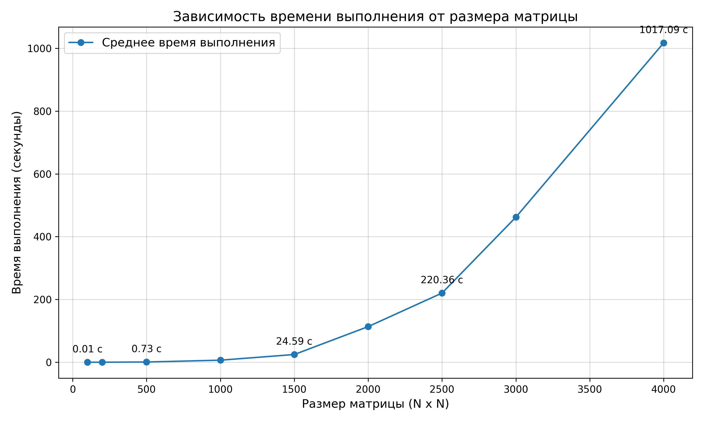

# ЛАБОРАТОРНАЯ РАБОТА 1
## <u>ЗАДАНИЕ</u>
Написать программу на языке C/C++ для перемножения двух матриц.
Исходные данные: файл(ы) содержащие значения исходных матриц.
Выходные данные: файл со значениями результирующей матрицы, время выполнения, объем задачи.
Обязательна автоматизированная верификация результатов вычислений с помощью сторонних библиотек или стороннего ПО (например на Matlab/Python).

Файл с кодом: main.cpp
Файл с генерацией матриц: rand.py
Файлы содержащие значения исходных матриц: ..._matrix_A.txt, ..._matrix_B.txt
Файл с результатом перемножения: ..._result_matrix.txt
Файлы с временем выполнения и объемом задачи: ..._performance.txt, result.txt
Автоматизированная верификация результатов вычислений: verifity.py
График зависимости времени выполнения от размера матрицы: matrix_time_plot.png

Программа генерирует квадратные матрицы разных размеров (100, 200, 500, 1000, 1500, 2000, 2500, 3000, 4000) со случайными значениями от 0 до 101. Далее две матрицы перемножаются и проходят верификацию с помощью python. Результаты перемножения, время выполнения и объем задачи сохраняются в файлы. Для каждого размера матрицы проводится по 5 измерений для нахожденя среднего значения времени, после чего данные всех матриц фиксируются в одном файле, на основе которого в дальнейшем создается график зависимости.

## Среднее время выполнения
| Размер матрицы | Среднее время (сек) |
|----------------|---------------------|
| 100x100        | 0.00555312          |
| 200x200        | 0.0445903           |
| 500x500        | 0.7347004           |
| 1000x1000      | 6.550742            |
| 1500x1500      | 24.59438            |
| 2000x2000      | 113.46978           |
| 2500x2500      | 220.356             |
| 3000x3000      | 462.0974            |
| 4000x4000      | 1017.085            |

## Вывод
* Время выполнения растёт нелинейно
* Все матрицы вычислены верно и прошли верификацию

