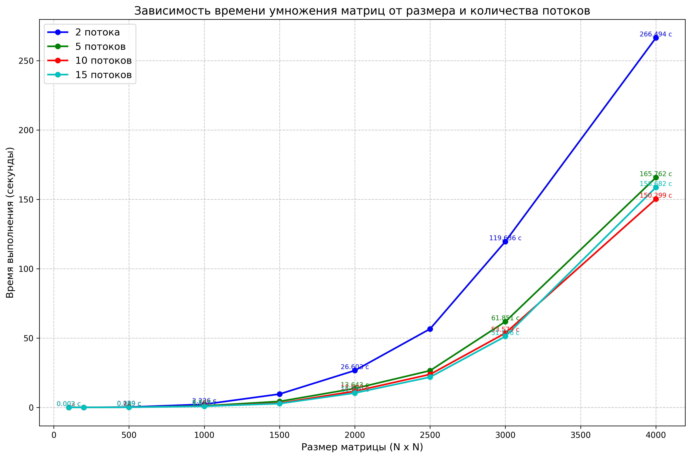

# ЛАБОРАТОРНАЯ РАБОТА 1
## <u>ЗАДАНИЕ</u>
Модифицировать программу для параллельной работы по технологии OpenMP.

Файл с кодом: main.cpp
Файл с генерацией матриц: rand.py
Файлы содержащие значения исходных матриц: ..._matrix_A.txt, ..._matrix_B.txt
Файл с результатом перемножения: ..._result_matrix.txt
Файлы с временем выполнения, объемом задачи и потоками: ..._performance.txt, result.txt
Автоматизированная верификация результатов вычислений: verifity.py
График зависимости времени выполнения от размера матрицы и потоков: matrix_times.png

Программа генерирует квадратные матрицы разных размеров (100, 200, 500, 1000, 1500, 2000, 2500, 3000, 4000) со случайными значениями от 0 до 101. Она умножает матрицы, используя технологию OpenMP. Результаты перемножения, время выполнения, объем задачи и количество потоков сохраняются в соответствующие файлы. Для каждого размера матрицы проводится по 5 измерений для нахожденя среднего значения времени, после чего данные всех матриц фиксируются в одном файле, на основе которого в дальнейшем создается график зависимости.

## Среднее время выполнения
### для 2 потоков
| Размер матрицы | Среднее время (сек) |
|----------------|---------------------|
| 100x100        | 0.00297406 секунд   |
| 200x200        | 0.0163028 секунд    |
| 500x500        | 0.238626 секунд     |
| 1000x1000      | 2.225948 секунд     |
| 1500x1500      | 9.620178 секунд     |
| 2000x2000      | 26.60344 секунд     |
| 2500x2500      | 56.62016 секунд     |
| 3000x3000      | 119.6356 секунд     |
| 4000x4000      | 266.4938 секунд     |

### для 5 потоков
| Размер матрицы | Среднее время (сек) |
|----------------|---------------------|
| 100x100        | 0.00233548 секунд   |
| 200x200        | 0.01418254 секунд   |
| 500x500        | 0.1485558 секунд    |
| 1000x1000      | 1.101212 секунд     |
| 1500x1500      | 4.317358 секунд     |
| 2000x2000      | 13.64298 секунд     |
| 2500x2500      | 26.5193 секунд      |
| 3000x3000      | 61.85082 секунд     |
| 4000x4000      | 165.7624 секунд     |

### для 10 потоков
| Размер матрицы | Среднее время (сек) |
|----------------|---------------------|
| 100x100        | 0.00210108 секунд    |
| 200x200        | 0.0115744 секунд     |
| 500x500        | 0.1289502 секунд     |
| 1000x1000      | 0.8819496 секунд     |
| 1500x1500      | 3.029588 секунд      |
| 2000x2000      | 11.6883 секунд       |
| 2500x2500      | 23.81652 секунд      |
| 3000x3000      | 53.57852 секунд      |
| 4000x4000      | 150.2994 секунд      |

### для 15 потоков
| Размер матрицы | Среднее время (сек) |
|----------------|---------------------|
| 100x100        | 0.00250444 секунд   |
| 200x200        | 0.0105127 секунд    |
| 500x500        | 0.09892888 секунд   |
| 1000x1000      | 0.8125626 секунд    |
| 1500x1500      | 2.738422 секунд     |
| 2000x2000      | 10.381544 секунд    |
| 2500x2500      | 21.8557 секунд      |
| 3000x3000      | 51.19552 секунд     |
| 4000x4000      | 158.6822 секунд     |

## Вывод
* Время выполнения растёт нелинейно
* Наиболее эффективно использование 5-15 потоков, в то же время потоки, превыщающие значение 10, не сильно увеличивают производительность, поэтому оптимальный диапазон 5-10 потоков
* При использовании технологии OpenMP, по сравнению с последовательным умножением матриц, наблюдается ускорение вычислений в 4-8 раз
* Все матрицы прошли верификацию

