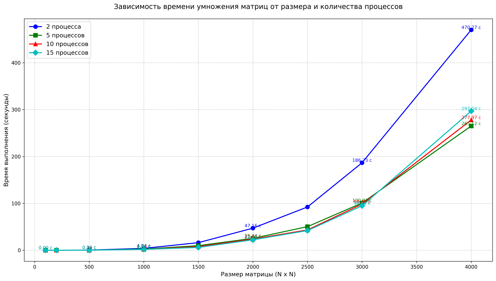
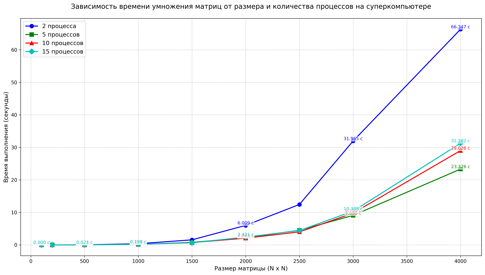

# ЛАБОРАТОРНАЯ РАБОТА 1
## <u>ЗАДАНИЕ</u>
Модифицировать программу для параллельной работы по технологии MPI.

Файл с кодом: main.cpp
Файл с генерацией матриц: rand.py
Файлы содержащие значения исходных матриц: ..._matrix_A.txt, ..._matrix_B.txt
Файл с результатом перемножения: ..._result_matrix.txt
Файлы с временем выполнения, объемом задачи и процессами: ..._performance.txt, result_pc.txt, result_sc.txt
Автоматизированная верификация результатов вычислений: verifity.py
График зависимости времени выполнения от размера матрицы и процессов: matrix_pc_times_log.png, matrix_sc_times_log.png

Программа генерирует квадратные матрицы разных размеров (100, 200, 500, 1000, 1500, 2000, 2500, 3000, 4000) со случайными значениями от 0 до 101. Она умножает матрицы, используя технологию MPI. Результаты перемножения, время выполнения, объем задачи и количество процессов сохраняются в соответствующие файлы. Для каждого размера матрицы проводится по 5 измерений для нахожденя среднего значения времени, после чего данные всех матриц фиксируются в одном файле, на основе которого в дальнейшем создается график зависимости. Программа также была запущена на суперкомпьютере «Сергей Королёв», все данные представлены ниже.

## Среднее время выполнения
### для 2 процессов
| Размер матрицы | Среднее время (сек) |
|----------------|---------------------|
| 100x100        | 0.00323726 секунд   |
| 200x200        | 0.0237566 секунд    |
| 500x500        | 0.391544 секунд     |
| 1000x1000      | 4.0418 секунд       |
| 1500x1500      | 16.2263 секунд      |
| 2000x2000      | 47.1575 секунд      |
| 2500x2500      | 92.3653 секунд      |
| 3000x3000      | 186.729 секунд      |
| 4000x4000      | 470.266 секунд      |

### для 5 процессов
| Размер матрицы | Среднее время (сек) |
|----------------|---------------------|
| 100x100        | 0.00214042 секунд   |
| 200x200        | 0.022996 секунд     |
| 500x500        | 0.288423 секунд     |
| 1000x1000      | 2.57036 секунд      |
| 1500x1500      | 9.82842 секунд      |
| 2000x2000      | 25.4426 секунд      |
| 2500x2500      | 50.3839 секунд      |
| 3000x3000      | 100.819 секунд      |
| 4000x4000      | 265.117 секунд      |

### для 10 процессов
| Размер матрицы | Среднее время (сек) |
|----------------|---------------------|
| 100x100        | 0.00169984 секунд   |
| 200x200        | 0.0123924 секунд    |
| 500x500        | 0.157158 секунд     |
| 1000x1000      | 1.83077 секунд      |
| 1500x1500      | 7.78483 секунд      |
| 2000x2000      | 23.8221 секунд      |
| 2500x2500      | 43.4085 секунд      |
| 3000x3000      | 98.4561 секунд      |
| 4000x4000      | 277.968 секунд      |

### для 15 процессов
| Размер матрицы | Среднее время (сек) |
|----------------|---------------------|
| 100x100        | 0.0021235 секунд    |
| 200x200        | 0.0160585 секунд    |
| 500x500        | 0.196307 секунд     |
| 1000x1000      | 1.80658 секунд      |
| 1500x1500      | 6.08467 секунд      |
| 2000x2000      | 22.2866 секунд      |
| 2500x2500      | 41.991 секунд       |
| 3000x3000      | 94.858 секунд       |
| 4000x4000      | 297.04 секунд       |

## Среднее время выполнения на суперкомпьютере
### для 2 процессов
| Размер матрицы | Среднее время (сек) |
|----------------|---------------------|
| 100x100        | 0.000362832 секунд  |
| 200x200        | 0.00238521 секунд   |
| 500x500        | 0.0361243 секунд    |
| 1000x1000      | 0.370138 секунд     |
| 1500x1500      | 1.56183 секунд      |
| 2000x2000      | 6.00893 секунд      |
| 2500x2500      | 12.449 секунд       |
| 3000x3000      | 31.9655 секунд      |
| 4000x4000      | 66.3468 секунд      |

### для 5 процессов
| Размер матрицы | Среднее время (сек) |
|----------------|---------------------|
| 100x100        | 0.000212184 секунд  |
| 200x200        | 0.0014972 секунд    |
| 500x500        | 0.0194731 секунд    |
| 1000x1000      | 0.167477 секунд     |
| 1500x1500      | 0.770571 секунд     |
| 2000x2000      | 2.25597 секунд      |
| 2500x2500      | 4.49865 секунд      |
| 3000x3000      | 9.0901 секунд       |
| 4000x4000      | 23.3257 секунд      |

### для 10 процессов
| Размер матрицы | Среднее время (сек) |
|----------------|---------------------|
| 100x100        | 0.00017901 секунд   |
| 200x200        | 0.00163199 секунд   |
| 500x500        | 0.0230381 секунд    |
| 1000x1000      | 0.221024 секунд     |
| 1500x1500      | 0.705775 секунд     |
| 2000x2000      | 2.0836 секунд       |
| 2500x2500      | 4.00801 секунд      |
| 3000x3000      | 9.7946 секунд       |
| 4000x4000      | 29.0264 секунд      |

### для 15 процессов
| Размер матрицы | Среднее время (сек) |
|----------------|---------------------|
| 100x100        | 0.000272316 секунд  |
| 200x200        | 0.00152061 секунд   |
| 500x500        | 0.0205649 секунд    |
| 1000x1000      | 0.188315 секунд     |
| 1500x1500      | 0.647608 секунд     |
| 2000x2000      | 2.42113 секунд      |
| 2500x2500      | 4.42007 секунд      |
| 3000x3000      | 10.3891 секунд      |
| 4000x4000      | 31.2816 секунд      |

## Вывод
* Время выполнения растёт нелинейно
* Наиболее эффективно использование 5-15 процессов, в то же время процессы, превыщающие значение 10, не сильно увеличивают производительность, поэтому оптимальный диапазон 5-10 процессов
* При использовании технологии MPI, по сравнению с последовательным умножением матриц, наблюдается ускорение вычислений в 3-6 раз
* Суперкомпьютер «Сергей Королёв» дает преимущество в вычислениях больших матриц, сокращая время примерно в 10 раз
* Все матрицы прошли верификацию

